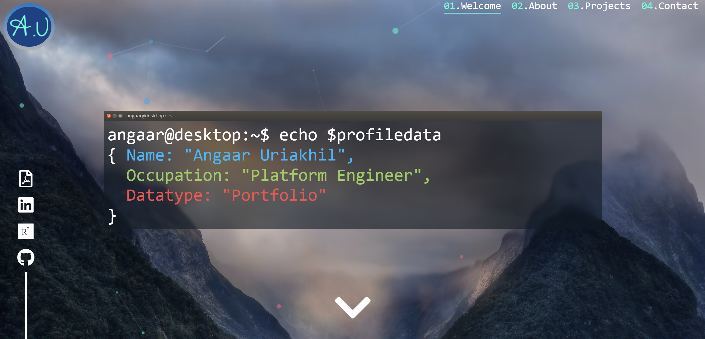

# Portfolio 

Personal Portfolio website initially built during week 2 of my software development course at \_nology and then continually updated as I improved my skills on the course and completed more projects. 

Responsive on PC or Mobile. 

## Design 

The wireframe for the project was designed on [Figma](https://www.figma.com/file/UQ7NcCBE9NScccttfMR9e2/Portfolio---Week-1?node-id=0%3A1). 

I endeavoured to get a 1:1 recreation of the wireframe during development and I think I got it pretty close. 
As time went on, I adapted the design to accomodate for responsiveness and to better present the information. 

### Languages/Frameworks/CDN's Used

* HTML 5
* CSS 3/SCSS
* Javascript ES6
* Particles.js by [Vincent Garreau](https://github.com/VincentGarreau/particles.js/) for fancy background particle effect. 
* Intersection Observer API for responsive underline on the navigation elements according to the page being viewed. 
* Hamburgers by [jonsuh](https://www.jonsuh.com/hamburgers) for hamburger menu and associated animation. 
* Terminal CSS styling adapted from [FOBABS](https://dev.to/fobabs/how-i-built-a-typical-ubuntu-terminal-using-html-css-1bpj).
* TypeIt.js by [Alex MacArthur](https://typeitjs.com) for typing animation on landing page terminal window. 
* interact.js by [Taye Adeyemi](https://interactjs.io/) for draggable functionality on landing page terminal window. 
